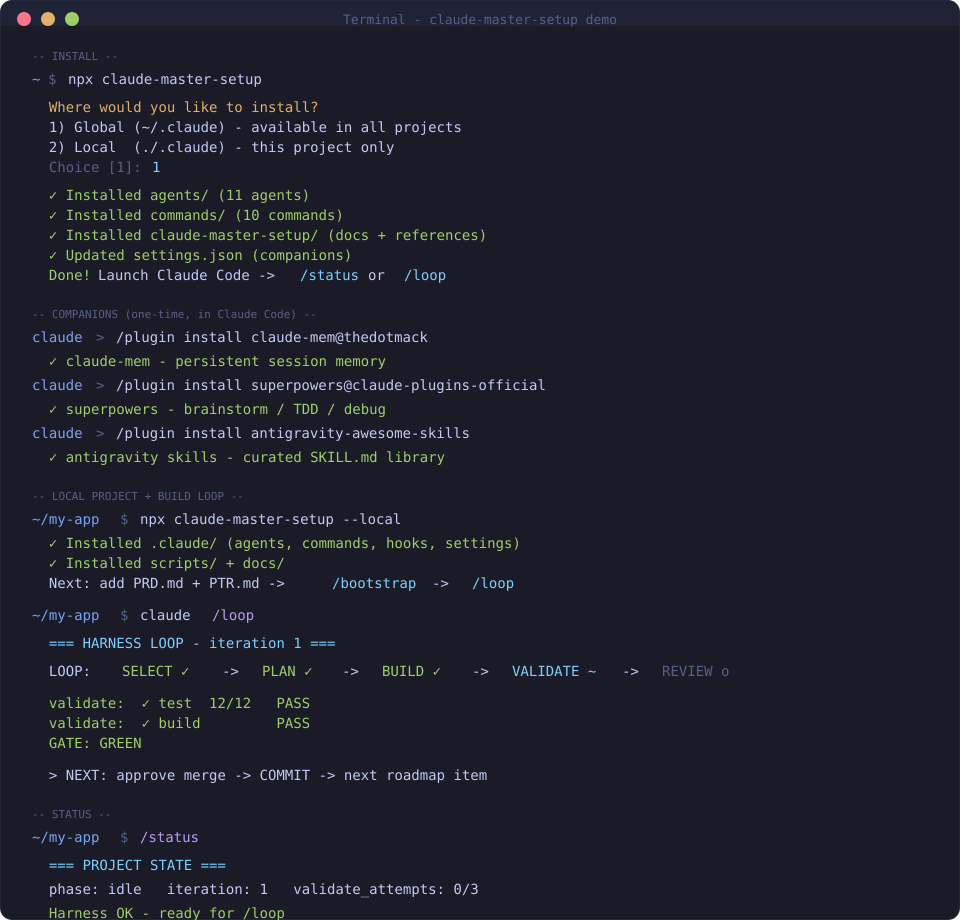

# Claude Master Setup

[](https://www.npmjs.com/package/claude-master-setup)
[](LICENSE)
[](https://github.com/AnupDangi/Claude-Master-Setup)

**Autonomous engineering harness for Claude Code** — plan, build, validate, review, and commit in a repeatable loop with specialist subagents and hard quality gates.

```bash
npx claude-master-setup
```



An **autonomous software engineering harness for Claude Code**. Drop in your
requirements and it plans, builds, validates, reviews, documents, and commits
work as an engineered loop — instead of a sequence of one-off prompts. The core
loop works from the files in this repo alone; optional companions (claude-mem,
superpowers, Antigravity skills) are recommended for a full Claude Code setup —
see [`docs/COMPANIONS.md`](docs/COMPANIONS.md). Full vision in
[`docs/VISION.md`](docs/VISION.md).

```
/bootstrap   # PRD + PTR  → architecture, CLAUDE.md, docs/, roadmap  (no code yet)
/loop        # runs the build loop until the roadmap is done, gates and all
```

## Why it exists

Without a harness, every session re-runs the same loop by hand, and quality
depends on whoever's prompting remembering to ask for tests, review the diff,
and update the docs:

```
Prompt → Code → Prompt → Code → Prompt → Code …
```

With the harness, the same bar applies every time because it's enforced by the
loop and recorded in the repository, not held in memory of what to ask for:

```
Goal → Plan → [approve] → Build → Validate (hard gate) → Review → [approve] → Commit
```

## New to Claude? Start here

Take these three, in order, before anything else:

1. [Claude 101](https://anthropic.skilljar.com/claude-101)
2. [Claude Code 101](https://anthropic.skilljar.com/claude-code-101)
3. [Claude Code in Action](https://anthropic.skilljar.com/claude-code-in-action)

Going deeper — MCP, skills, subagents:

4. [Introduction to Model Context Protocol](https://anthropic.skilljar.com/introduction-to-model-context-protocol)
5. [Model Context Protocol: Advanced Topics](https://anthropic.skilljar.com/model-context-protocol-advanced-topics)
6. [Introduction to Agent Skills](https://anthropic.skilljar.com/introduction-to-agent-skills)
7. [Introduction to Subagents](https://anthropic.skilljar.com/introduction-to-subagents)

## Architecture 


## What's inside

```
CLAUDE.md                 # permanent project memory + how the harness works
MASTER-PROMPT.md          # the /bootstrap prompt: PRD+PTR → engineering foundation
.claude/
├── agents/               # 11 subagents (orchestrator, planner, architect,
│                         #   implementer + implementer-opus, validator,
│                         #   reviewer, security, docs-writer, mcp-scout,
│                         #   evaluator)
├── commands/             # 10 slash commands (/loop, /plan, /validate, /review,
│                         #   /mcp-add, /bootstrap, /handoff, /status, /ship,
│                         #   /evaluate)
├── hooks/                # fail-safe shell hooks (guard, protect, track, remind)
├── context/              # optional mode profiles (dev, review, research)
├── state/                # loop state (gitignored, worktree-local)
└── settings.json         # permissions + hooks — self-contained, no plugin
docs/                     # VISION, LOOP_ENGINE, STATE_ENGINE, MODEL_ROUTING,
│                         #   EVALUATION, LOOP, AGENTS, MCP, SETUP + full
│                         #   per-project doc set
scripts/
├── validate.sh           # the gate: format, lint, typecheck, test, build (auto-detected)
├── detect-stack.sh       # stack/package-manager detection
├── install.sh            # one-shot setup
├── self-check.sh         # verify the harness is wired correctly
└── mcp-catalog.json      # curated tool → MCP-server map
```

No signup, no config wizard. Just files Claude Code already knows how to read.

## Quick start

Install into **Claude Code** (same UX as tools like Forge) — interactive global vs local:

```bash
# Prerequisite: Claude Code CLI must already be installed
#   npm install -g @anthropic-ai/claude-code
#   # or: brew install --cask claude-code
# Then:
npx claude-master-setup
```

```text
  Where would you like to install?

  1) Global (~/.claude) - available in all projects
  2) Local  (./.claude) - this project only

  Choice [1]:
```

Or skip the prompt:

```bash
npx claude-master-setup --global   # agents + commands → ~/.claude (all projects)
npx claude-master-setup --local    # full harness → ./.claude + scripts/docs (this repo)
```

```bash
claude                       # start Claude Code — agents/commands load automatically
# then:
/bootstrap                   # (local projects with PRD.md / PTR.md)
/loop                        # run the build loop
/status                      # where you are
```

**Global** installs agents + slash commands into `~/.claude/` so `/loop`,
`/plan`, `/validate`, … work in any project. It also merges recommended
companion marketplaces into `~/.claude/settings.json` (claude-mem, superpowers,
code-review, Antigravity skills), and installs a `statusline.sh` (model / git /
context / cost) **only if you don’t already have one**. **Local** also drops hooks,
`scripts/validate.sh`, and docs into the current repo (needed for the hard
validation gate). Re-running is safe: existing dirs are timestamp-backed up.

### Recommended companions

`--global` / `--local` **merge** companion marketplaces + `enabledPlugins` into
`settings.json`. They do **not** spawn a shell or download plugins (keeps the
npm package free of shell/network installer behavior). Print the `claude plugin …`
commands and run them yourself (or use `/plugin` in Claude Code).

| Plugin | Why |
|---|---|
| **claude-mem** | Persistent memory across sessions |
| **superpowers** | Brainstorm / TDD / systematic debugging |
| **code-review** | Extra review depth next to `/review` |
| **antigravity-awesome-skills** | Large curated skill library |

Details: [`docs/COMPANIONS.md`](docs/COMPANIONS.md). Restart Claude Code after
plugin install, then `/learn-codebase` once per repo (claude-mem) before `/loop`.

Scanner notes: [`docs/NPM_SECURITY.md`](docs/NPM_SECURITY.md).

Other install paths (same harness files):

```bash
# Legacy scaffold into a new folder
npx claude-master-setup --scaffold my-project

# Git clone
git clone https://github.com/AnupDangi/Claude-Master-Setup.git my-project
cd my-project && bash scripts/install.sh
```

See [`docs/OPERATIONS.md`](docs/OPERATIONS.md) and [`docs/SETUP.md`](docs/SETUP.md).
Then add your requirements and bootstrap:

```
my-project/
├── PRD.md   # Product Requirements Document
└── PTR.md   # Project Technical Requirements
```

```
/bootstrap    # generates architecture, CLAUDE.md, docs/, and a build roadmap — no code yet
/loop         # builds the roadmap, one validated increment at a time
```
## Core capabilities

**Built and working today:**

- **Build loop** — plan → build → validate → review → commit, with two human
  approval gates and one hard automated gate. [`docs/LOOP.md`](docs/LOOP.md)
- **Validation retry cap** — RED results loop back to BUILD up to
  `HARNESS_MAX_VALIDATE_RETRIES` (default 3) times, then the loop stops and
  escalates to a human (`await-human-on-red`) instead of retrying forever.
- **Subagent system** — 11 least-privilege specialists, isolated context per
  call. [`docs/AGENTS.md`](docs/AGENTS.md)
- **State tracking** — `.claude/state/loop.json` plus `docs/PROJECT_STATE.md`
  so a fresh session can resume with zero conversation history.
  [`docs/STATE_ENGINE.md`](docs/STATE_ENGINE.md)
- **Model routing** — Haiku/Sonnet/Opus matched to each agent's job, static for
  most agents, dynamic for the highest-value case: BUILD delegates to
  `implementer` (Sonnet) or `implementer-opus` (Opus) based on task
  complexity. [`docs/MODEL_ROUTING.md`](docs/MODEL_ROUTING.md)
- **`npx`-installable** — `npx claude-master-setup` installs into Claude Code
  (`--global` → `~/.claude`, `--local` → `./.claude`) with an interactive prompt;
  `--scaffold [dir]` remains for legacy folder dumps.
- **MCP discovery** — `/mcp-add` finds and wires external tools with consent.
  [`docs/MCP.md`](docs/MCP.md)
- **Task graphs** — `planner` splits an oversized roadmap item into an
  ordered, pre-approved sub-task list instead of silently taking one slice.
- **Dependency-aware SELECT** — `docs/ROADMAP.md` items can declare
  `(depends: ...)`; the orchestrator skips unsatisfied candidates and states
  why. [`docs/LOOP.md`](docs/LOOP.md)
- **`/evaluate` scorecard (objective metrics only)** — tests/build status,
  an iteration-count proxy from git history, and documentation completeness.
  Explicitly does **not** score planning, architecture, security, or
  performance yet, and reports "not tracked" for manual interventions rather
  than guessing. [`docs/EVALUATION.md`](docs/EVALUATION.md)

**Designed, not yet built** (tracked in [`docs/ROADMAP.md`](docs/ROADMAP.md)):

- **Subjective evaluation metrics** — planning/architecture/security/
  performance scoring, and feeding scores back into SELECT decisions.
  [`docs/EVALUATION.md`](docs/EVALUATION.md)
- **Benchmark suite, template library, plugin/marketplace packaging** — see
  Milestone 3 in [`docs/ROADMAP.md`](docs/ROADMAP.md).

## The build loop

The loop is the product. Full spec in [`docs/LOOP.md`](docs/LOOP.md); target
architecture in [`docs/LOOP_ENGINE.md`](docs/LOOP_ENGINE.md). It has been run
end-to-end with real subagents against a throwaway project — see
[`docs/VALIDATION.md`](docs/VALIDATION.md) for what was tested and the
honest limitations found.

```
SELECT → PLAN → [approve plan] → BUILD → VALIDATE (hard gate, retry-capped)
       → REVIEW → [approve merge] → COMMIT → update docs → LOOP
```

- **Two human gates** (approve the plan, approve the merge) + **one automated gate**
  (validation). None can be skipped.
- **Validation hard-blocks.** RED means the loop returns to BUILD and will not
  advance. GREEN is binary — no "green with warnings," no skipping a check to pass.
  After `HARNESS_MAX_VALIDATE_RETRIES` consecutive RED results, the loop stops
  itself and asks a human instead of retrying forever.
- **One shippable unit per iteration.** New scope goes on the roadmap, not into the
  current task.
- Stop anytime; resume with `/loop`. The **repository** remembers where it was, not
  the chat.

## Subagents

Eleven least-privilege specialists in `.claude/agents/` ([reference](docs/AGENTS.md)).
Only `implementer`/`implementer-opus` write feature code (never both on the
same task); the reviewers and validator are read-only; `mcp-scout` only
touches `.mcp.json`. Each runs in its own context and returns a summary,
keeping the main thread focused and cheap. Model routing is static for most
agents and dynamic for one pair — see [`docs/MODEL_ROUTING.md`](docs/MODEL_ROUTING.md).
For how to invoke any agent directly, and how (and how not) to run several at
once, see [`docs/OPERATIONS.md`](docs/OPERATIONS.md).

## Memory system

Four layers, one home per fact — see the "Four memory layers" table in
[`CLAUDE.md`](CLAUDE.md): `PRD.md`/`PTR.md` (requirements, rarely change),
`CLAUDE.md` (stable conventions), `docs/` (shared, current-state knowledge,
changes often), and Claude Code's per-worktree auto-memory (continuous, local).

**Companions** (claude-mem, superpowers, code-review, Antigravity skills) close
gaps that the harness alone does not — especially persistent memory and process
skills. `npx claude-master-setup --global` installs them via
`claude plugin marketplace add` / `claude plugin install` when possible.
Manual fallback: [`docs/COMPANIONS.md`](docs/COMPANIONS.md).

Pair with the harness:

- After `/bootstrap` (or when adopting an existing project), run
  `/learn-codebase` once so claude-mem has full repo context from day one.
- Keep using `docs/PROJECT_STATE.md`, `docs/SESSION.md`, and `docs/DECISIONS.md`
  as the **durable, reviewable** source of truth — claude-mem is a low-friction
  recall layer on top of those, not a replacement.
- Use Antigravity / superpowers skills when the task matches; use `/loop` for
  the engineered build cycle.
## Adding tools (MCP)

When a task needs an external service, run `/mcp-add <tool>`. The **mcp-scout** checks
`scripts/mcp-catalog.json`, then the web, and **asks before** wiring anything into
`.mcp.json` — always with `${ENV_VAR}` references (never literal secrets) and
least-privilege scopes. Details in [`docs/MCP.md`](docs/MCP.md).

```
/mcp-add postgres     # → "add the Postgres MCP server? it needs DATABASE_URL"
```

## Parallel work: git worktrees

Once you're juggling independent features, run each in its own worktree:

```bash
git worktree add ../myproj-payments feat/payments
cd ../myproj-payments && claude    # its own loop, shared docs/, isolated auto-memory
```

Two loops run without colliding. See [`docs/DEVELOPMENT_WORKFLOW.md`](docs/DEVELOPMENT_WORKFLOW.md).

## Installation scope: project, user, or session

Three ways to adopt this, depending on how permanent you want it:

- **Project level (default, what ships here).** `.claude/` lives in the repo
  root, committed and shared with the team. This is the only scope where
  `scripts/validate.sh` makes sense unmodified — it's written against *this*
  project's stack.
- **User level (every project, globally).** Copy `.claude/agents/*.md` and
  `.claude/commands/*.md` into `~/.claude/agents/` and `~/.claude/commands/`
  so the 11 specialists and 10 commands are available no matter which repo you
  open. `scripts/` is still per-project (it runs against that project's real
  build/test commands) — copy it into each project you want the gate in, or
  package the whole harness as a plugin (see Growth path, step 5) so
  installing it anywhere is one command.
- **Session level (try it, install nothing).** Two options: `claude
  --settings .claude/settings.json` from any directory layers in the
  harness's permissions/hooks for that session only; or simplest of all,
  just `cd` into a clone/worktree of this repo and run `claude` there —
  nothing is installed anywhere, it only applies to that directory.

Full detail in [`docs/SETUP.md`](docs/SETUP.md).

## Growth path

Start minimal, add capability only when a real need appears:

1. **Solo, single stream** — `/bootstrap` → `/loop`. A complete workflow on day one.
2. **Add tools** — `/mcp-add` when a task needs a DB, GitHub, or a browser.
3. **Parallelize** — git worktrees for independent features.
4. **Loosen autonomy** — auto-approve GATE 1 for low-risk tasks in a trusted project
   (validation gate always stays on).
5. **Bundle & share** — package your stabilized agents/commands as a Claude Code
   plugin; add stack-specific reviewers as the codebase grows. This stays
   **optional** — see [`docs/DECISIONS.md`](docs/DECISIONS.md) ADR-000 and
   ADR-001 for why the default install stays self-contained.
6. **Measure and evolve** — once `/evaluate` exists (see
   [`docs/EVALUATION.md`](docs/EVALUATION.md)), use its scorecard to see where
   the loop is actually weak instead of guessing.

Full guide in [`docs/SETUP.md`](docs/SETUP.md).

--

Drop a 🌟 if it helped you.
