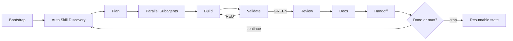

# Claude Master Setup

Production-ready, token-efficient Claude Code loops.

The extension understands **your repository first**, discovers the best local
skills automatically, routes work to the right agent(s), validates every
increment, and continues until completion or `--max-iterations`.

```bash
npx claude-master-setup@latest
# or
claude plugin marketplace add AnupDangi/Claude-Master-Setup
claude plugin install master@claude-master-setup
```

Then: `/bootstrap` → `/loop "ship the next outcome"`. If a loop is already active, re-issuing `/loop` steers (running) or resumes (paused) the existing iteration.

---

## Architecture

```text
┌──────────────────────────────────────────────────────────────────────┐
│ Shared framework  (~/.claude)                                        │
│  agents · commands · statusline.sh · hooks · scripts · templates     │
│  optional plugins/skills (claude-mem, Antigravity, official, …)      │
└───────────────────────────────┬──────────────────────────────────────┘
                                │ discovers / installs once
┌───────────────────────────────▼──────────────────────────────────────┐
│ Per project                                                          │
│  CLAUDE.md              project mission, stack, conventions          │
│  .master/project.json   maturity, validate_cmd, stack facts          │
│  .master/state/         loop.json · handoff.json · memory-pending    │
│  .master/docs/          optional short roadmap / generated docs      │
└──────────────────────────────────────────────────────────────────────┘
```

Framework knowledge stays in `~/.claude`. Project memory stays in the repo.
The loop reads JSON state — not a documentation dump — every iteration.

---

## Build loop

Continues until the completion signal is true **and** validation is GREEN, or
until `max-iterations` (default **2**).

Phased pipeline: GATE→PLAN→BUILD→VALIDATE→REVIEW→SHIP→COMPLETE.



| Phase | What happens |
|---|---|
| **Bootstrap** | Read README / manifests / source / tests. Write minimal `CLAUDE.md` + `.master/`. |
| **Auto Skill Discovery** | Rank local skills (project → user → plugin). Inject ≤3 relevant paths. |
| **Plan** | Direct for simple work; planner/task graph only when complexity needs it. |
| **Parallel Subagents** | Independent slices run in isolated worktrees (≤3 writers, file ownership). |
| **Build** | Implementers write code + tests for owned slices only. |
| **Validate** | `validate.sh` / project `validate_cmd`. Exit 0 = GREEN (validator agent sets `validation.agent`); anything else is RED. |
| **Review** | Combined quality + security pass delegated to the `reviewer` agent for important / sensitive changes. |
| **Docs** | Progressive evidence docs; `sync-project-docs.sh` runs at SHIP for existing/production projects. |
| **Handoff** | `.master/state/handoff.json` for the next session / agent. |
| **Next iteration** | Stop hook re-feeds a compact continuation until done or max. |

Adaptive orchestration: **simple → direct (zero subagents)** · **medium → one
implementer** · **complex → planner + parallel worktrees**.

---

## Skill & plugin ecosystem

`/loop` auto-discovers whatever is already installed locally. Install only what
you need:

| Source | Role |
|---|---|
| **Claude Master Skills** | Loop runtime skills shipped / selected with this package |
| **claude-mem** | Durable observations after push or meaningful complex solutions |
| **Antigravity Skills** | Large curated skill library (`sickn33/antigravity-awesome-skills`) |
| **Official Claude Plugins** | e.g. `superpowers`, `code-review` from `claude-plugins-official` |
| **Matt Pocock Skills** | TypeScript / production patterns under `~/.claude/skills` |
| **User / Community Skills** | Anything in project `.claude/skills` or `~/.claude/skills` |

```bash
claude plugin marketplace add thedotmack/claude-mem
claude plugin install claude-mem@thedotmack --scope user

claude plugin install superpowers@claude-plugins-official --scope user
claude plugin install code-review@claude-plugins-official --scope user

claude plugin marketplace add sickn33/antigravity-awesome-skills
claude plugin install antigravity-awesome-skills@antigravity-awesome-skills --scope user
```

---

## Commands

| Command | Purpose |
|---|---|
| `/bootstrap` | One-time: understand the repo, minimal project memory |
| `/loop "task"` | Adaptive loop until done or `--max-iterations` (default 2); if loop is active, `/loop` steers (running) or resumes (paused). |
| `/cancel` | Stop the active loop |
| `/status` | Human-readable loop status summary (+ recovery hint). |
| `/pause` | Persist a blocker for another session |
| `/handoff` | Refresh structured handoff (+ optional claude-mem bridge) |

Plugin namespace: `/master:*`.

```text
/master:loop "fix checkout tax rounding"
/master:loop "add OAuth login" --max-iterations 5
/master:loop "finish migration" --completion-promise "migration is verified"
```

---

## Install / update

**npm (recommended for shared runtime + statusline):**

```bash
cd your-project
npx claude-master-setup@latest
```

Installs to `~/.claude/`:

- `agents/`, `commands/`
- `statusline.sh` + `settings.json` `statusLine` wiring
- `claude-master-setup/` (scripts, hooks, templates, docs)

Seeds the project with `CLAUDE.md`, `.master/project.json`, idle `loop.json`,
optional roadmap. Never copies `.env` or `.github` into the project.

**Plugin:**

```bash
claude plugin marketplace add AnupDangi/Claude-Master-Setup
claude plugin install master@claude-master-setup
# later:
claude plugin marketplace update claude-master-setup
claude plugin update master@claude-master-setup
```

Prefer **one** path (npm **or** plugin) so hooks do not double-fire.

Verify statusline after install:

```bash
test -x "$HOME/.claude/statusline.sh" && echo "statusline OK"
python3 - <<'PY'
import json, os
from pathlib import Path
settings = json.loads(Path.home().joinpath(".claude/settings.json").read_text())
print(settings.get("statusLine"))
PY
```

---

## Why this shape

- **Parallel by default when safe** — file-disjoint worktrees, not serial agent chains.
- **Token-efficient** — JSON state + ≤3 skills; no harness manuals in `CLAUDE.md`.
- **Production-ready** — binary validation gate, protected paths, resumable handoffs.
- **Extensible** — drop skills into `~/.claude/skills` or project `.claude/skills`; the loop picks them up.

See [setup](docs/SETUP.md), [loop](docs/LOOP.md), and [security](docs/SECURITY.md).
