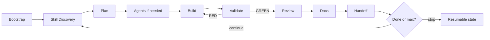

# Claude Master Setup

Fail-closed, token-efficient Claude Code loops.

The extension understands **your repository first**, discovers local skills,
routes work to the right agent(s), validates every increment, and continues until
completion or `--max-iterations`.

```bash
npx claude-master-setup@latest
# or
claude plugin marketplace add AnupDangi/Claude-Master-Setup
claude plugin install master@claude-master-setup
```

Then: `/bootstrap` → `/loop "ship the next outcome"`. Re-issuing `/loop` steers
(running) or resumes (paused).

---

## Architecture

```text
┌──────────────────────────────────────────────────────────────────────┐
│ Shared framework  (~/.claude)                                        │
│  agents · commands · statusline · hooks · scripts · outline templates│
└───────────────────────────────┬──────────────────────────────────────┘
                                │ install once
┌───────────────────────────────▼──────────────────────────────────────┐
│ Per project                                                          │
│  CLAUDE.md              mission, stack, conventions (≤40 lines)      │
│  .master/project.json   maturity, validate_cmd, runtime_check        │
│  .master/state/         loop.json · handoff · events.jsonl           │
│  .master/docs/          generated from evidence (never template-copy)│
└──────────────────────────────────────────────────────────────────────┘
```

Framework knowledge stays in `~/.claude`. Project memory stays in the repo.
The loop reads **JSON state**, not a documentation dump.

### Docs policy

`templates/master-docs/` are section **outlines** only. Install creates an empty
`.master/docs/`. `/bootstrap` and SHIP **write** ROADMAP/DESIGN/API/… from
repository evidence. Prefer create-from-scratch over copy-then-edit.

---

## Build loop

Stops when completion is signalled **and** validation is GREEN, or when
`max-iterations` is hit (`iteration_budget` in project.json, else **2**).

Phased pipeline: GATE→PLAN→BUILD→VALIDATE→REVIEW→SHIP→COMPLETE.



| Phase | What happens |
|---|---|
| **Bootstrap** | Read repo. Write minimal `CLAUDE.md` + `.master/` facts. Generate only needed docs. |
| **Skills** | Rank local skills; inject ≤3 paths. Allowlisted gaps via `ensure-skills.sh`. |
| **Plan** | Direct / delegated / parallel from classifier + downgrade-only policy. |
| **Build** | Delegated/parallel: Write/Edit blocked until `assigned_agents` is set. |
| **Validate** | `validate.sh` / `validate_cmd` (+ optional `runtime_check`). Exit 0 = GREEN. |
| **Review** | Combined quality + security for important/sensitive changes. |
| **Docs** | Evidence docs at SHIP (`sync-project-docs.sh` for existing/production). |
| **Handoff** | `.master/state/handoff.json` + JSONL events for `/status`. |

Routing: **simple → direct** · **medium → one implementer** · **complex → planner + ≤3 worktrees**.

### Fail-closed gates

- Product edits blocked in delegated/parallel until agents are assigned
- Completion requires GREEN + `ship_completed` (+ validator + `AGENT_TASK.md` when not direct)
- Stall detection pauses after no git progress; `/pause` / `/cancel` always write handoff

---

## Skill & plugin ecosystem

Install auto-installs a curated allowlist into `~/.claude/skills` via
[`npx skills`](https://github.com/vercel-labs/skills). Failures warn and continue.
Edit `templates/skills-allowlist.json` to change the set.

```bash
bash ~/.claude/claude-master-setup/scripts/install-skill.sh --suggest "deploy to vercel"
```

Discovery order: project skills → `~/.claude/skills` → plugins. Off-allowlist sources
are suggested, not auto-installed. Optional plugins (claude-mem, superpowers, …)
remain hints only.

---

## Commands

| Command | Purpose |
|---|---|
| `/bootstrap` | One-time: understand repo, minimal project memory |
| `/loop "task"` | Adaptive loop until done or max; steer/resume if active |
| `/cancel` | Stop the active loop |
| `/status` | Human summary + recent events + recovery hint |
| `/pause` | Persist a blocker for another session |
| `/handoff` | Refresh structured handoff |

Plugin namespace: `/master:*`.

```text
/master:loop "fix checkout tax rounding"
/master:loop "add OAuth login" --max-iterations 5
```

---

## Install / update

```bash
cd your-project
npx claude-master-setup@latest
```

Installs shared runtime under `~/.claude/` and seeds `CLAUDE.md` + `.master/`
(project.json, idle loop, empty docs/). Never copies `.env` or `.github`.

Prefer **one** path (npm **or** plugin). The installer warns if both are active.

---

## Why this shape

- **Fail-closed** — hooks enforce agent assignment and completion gates
- **Token-efficient** — JSON state + ≤3 skills; no harness manuals in `CLAUDE.md`
- **Generate docs** — evidence-backed files, not template dumps
- **Resumable** — handoff + events survive stalls and session boundaries

See [setup](docs/SETUP.md), [loop](docs/LOOP.md), and [security](docs/SECURITY.md).
