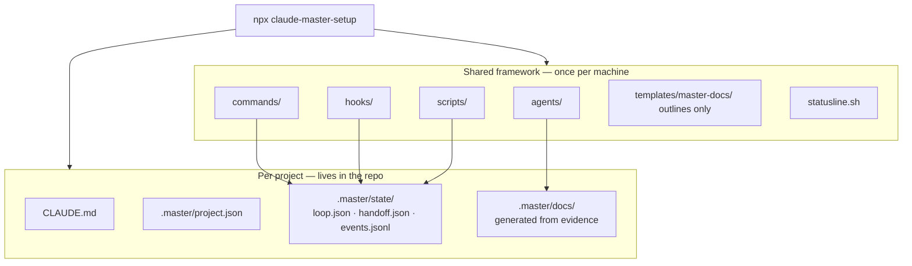
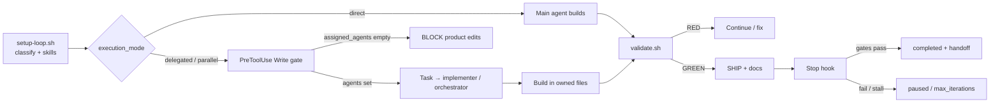

# Claude Master Setup

**v1.0** — A fail-closed coding harness for [Claude Code](https://docs.anthropic.com/en/docs/claude-code).

It understands **your repository first**, routes work (direct → delegated → parallel),
blocks cheating completions, and only finishes when validation is **GREEN**.

```bash
npx claude-master-setup@latest
```

Then in Claude Code: `/bootstrap` → `/loop "smallest shippable behaviour"`.

---

## What this product is

| It is | It is not |
|---|---|
| A shared Claude Code runtime (agents, hooks, scripts) | A chat wrapper or IDE |
| Project memory in `.master/` JSON | A docs dump into `CLAUDE.md` |
| Adaptive loops with hard gates | Unlimited autonomous coding |
| Opt-in skills + optional runtime checks | A full CI/CD platform |

**Upgrade note:** npm previously published `0.6.x`. This release is **`1.0.0`** — the first
stable product cut. Unreleased internal milestones (0.7–0.9) are folded into this version.

---

## Quick start

### 1. Prerequisites

- [Node.js](https://nodejs.org/) 18+
- [Claude Code](https://docs.anthropic.com/en/docs/claude-code) installed and logged in
- A git repository (required for parallel worktrees)

### 2. Install (pick one)

**npm (recommended — shared runtime + statusline):**

```bash
cd your-project
npx claude-master-setup@latest
```

**Plugin:**

```bash
claude plugin marketplace add AnupDangi/Claude-Master-Setup
claude plugin install master@claude-master-setup
```

Use **either** npm **or** plugin — not both. Dual install double-fires hooks; the
installer warns if it detects both.

### 3. Bootstrap, then loop

```text
/bootstrap
/loop "add input validation to the checkout total"
```

| If you installed… | Commands are… |
|---|---|
| npm | `/bootstrap`, `/loop`, `/status`, … |
| plugin | `/master:bootstrap`, `/master:loop`, … |

Re-issuing `/loop` while active **steers** (running) or **resumes** (paused).

---

## Architecture

### System layout



| Layer | Location | Role |
|---|---|---|
| Framework | `~/.claude/` (+ `claude-master-setup/`) | Agents, commands, hooks, scripts — install once |
| Project | repo root | Mission, facts, loop state, evidence docs |

The loop reads **JSON state**, not a documentation bundle. Framework manuals stay out of
consumer `CLAUDE.md`.

### Control plane (fail-closed)



Hard rules:

1. **Delegated/parallel** cannot Write/Edit product files until `assigned_agents` is set  
2. **Completion** needs GREEN validation + `ship_completed`  
3. **Non-direct** also needs `validation.agent == "validator"` and `AGENT_TASK.md` with `## Objective`  
4. **No git progress** across iterations → stall pause + handoff  

### Loop phases


| Phase | What happens |
|---|---|
| GATE | Clarity check; UI work without `DESIGN.md` → pause |
| PLAN | Route direct / delegated / parallel; ≤3 skill paths |
| BUILD | Implement + focused tests; respect `owned_files` |
| VALIDATE | `validate_cmd` / `validate.sh` (+ optional `runtime_check`) |
| REVIEW | Quality + security for important/sensitive changes |
| SHIP | Commit; sync evidence docs when maturity warrants |
| COMPLETE | Handoff + events; `<loop-complete/>` or promise tag |

Routing: **simple → direct** · **medium → one implementer** · **complex → planner + ≤3 worktrees**.  
Mode may **downgrade** only (parallel → delegated → direct). Upgrade requires the planner.

### Docs policy

Install creates an **empty** `.master/docs/`. Docs are **written from repository evidence**
at bootstrap or SHIP — never bulk-copied from templates.

`templates/master-docs/` are **section outlines** (headings only). Agents may peek; they
must not `cp` those files into the project.

---

## Commands

| Command | Purpose |
|---|---|
| `/bootstrap` | One-time: infer mission, maturity, `.master/` facts |
| `/loop "task"` | Run until done or max iterations; steer / resume if active |
| `/status` | Mode, routing reason, agents, recent events, recovery hint |
| `/pause` | Persist a blocker + handoff |
| `/cancel` | Stop the loop + handoff |
| `/handoff` | Refresh structured handoff (optional claude-mem bridge) |

Examples:

```text
/loop "fix tax rounding on checkout"
/loop "add OAuth login" --max-iterations 5
/loop "migration verified" --completion-promise "migration is verified"
```

Defaults: `max_iterations` from `.master/project.json` → `iteration_budget` (else **2**).

---

## Project files you should know

After install + bootstrap:

```text
your-project/
├── CLAUDE.md                 # ≤40 lines: mission, stack, run/verify
└── .master/
    ├── project.json          # maturity, validate_cmd, iteration_budget, runtime_check
    ├── state/
    │   ├── loop.json         # active machine state
    │   ├── handoff.json      # cross-session resume
    │   └── history/events.jsonl
    └── docs/                 # evidence-generated (optional files)
```

Never committed by the harness: `.env`, `.github`, or framework agents into the project.

---

## Skills

On install, a curated allowlist is installed into `~/.claude/skills` via
[`npx skills`](https://github.com/vercel-labs/skills) (best-effort; network failures warn).

During `/loop`, `ensure-skills.sh` may install up to **two** allowlisted missing matches,
then inject ≤3 skill paths.

```bash
# Suggest matches for a task
bash ~/.claude/claude-master-setup/scripts/install-skill.sh --suggest "deploy to vercel"

# Allowlisted install
bash ~/.claude/claude-master-setup/scripts/install-skill.sh vercel-labs/agent-skills \
  --skill "web-design-guidelines"
```

Discovery order: project `.claude/skills` + `.agents/skills` → user skills → plugins.  
Off-allowlist sources are **suggested**, not auto-installed. Edit
`templates/skills-allowlist.json` to change the curated set.

---

## Checklist — are you missing something?

Use this after install. If a row fails, fix it before expecting good loops.

| Check | How | If missing |
|---|---|---|
| Claude Code present | `claude --version` | Install Claude Code first |
| Harness installed | `ls ~/.claude/claude-master-setup/scripts/setup-loop.sh` | Re-run `npx claude-master-setup@latest` |
| Statusline (npm path) | `test -x ~/.claude/statusline.sh` | Re-run installer; see [setup](docs/SETUP.md) |
| Project seeded | `test -f CLAUDE.md && test -f .master/project.json` | Run installer in the project, then `/bootstrap` |
| Not dual-installed | Only npm **or** plugin hooks in settings | Remove one path; installer warns |
| Validation works | `bash ~/.claude/claude-master-setup/scripts/validate.sh` | Set `validate_cmd` in `.master/project.json` |
| UI product has DESIGN | `.master/docs/DESIGN.md` for React/Vue/etc. | `/bootstrap` or write DESIGN before BUILD |
| Runtime truth (apps) | Optional `runtime_check` in project.json | e.g. `"curl -sf http://localhost:3000/health"` |
| Git for parallel | `git rev-parse --is-inside-work-tree` | Init git before parallel mode |
| Loop stuck? | `/status` | Read `pause_reason` / events; `/loop` to resume or `/cancel` |

### Common gaps

1. **No tests / no `validate_cmd`** — gate stays weak; add a real test script.  
2. **UI without DESIGN.md** — loop should pause; don’t skip it.  
3. **GREEN unit tests, dead app** — set `runtime_check` for a smoke URL.  
4. **Expecting auto-magic architecture** — harness pauses on ambiguity; answer `/pause` questions.  
5. **Huge first prompt** — start with the smallest shippable behaviour.

---

## Enhance it (for power users)

| Goal | What to change |
|---|---|
| Stricter validation | `.master/project.json` → `validate_cmd`, `runtime_check` |
| More / fewer iterations | `iteration_budget` or `/loop ... --max-iterations N` |
| Custom skills | Drop skills in project `.claude/skills` or extend the allowlist |
| Visual product | Keep `.master/docs/DESIGN.md` current |
| Architecture history | Append ADRs to `.master/docs/DECISIONS.md` |
| Debug a loop | `/status` + `.master/state/history/events.jsonl` |
| Parallel slices | Complex prompts with multi-surface signals; git required |

Maintainer / framework edits: see [CLAUDE.md](CLAUDE.md). Control-plane files need
`HARNESS_ALLOW_PROTECTED_EDITS=1`.

Deep dives: [setup](docs/SETUP.md) · [loop](docs/LOOP.md) · [security](docs/SECURITY.md) · [changelog](docs/CHANGELOG.md)

---

## Verify the package (maintainers)

```bash
npm test
npm pack --dry-run
```

---

## License

MIT © Anup Dangi
